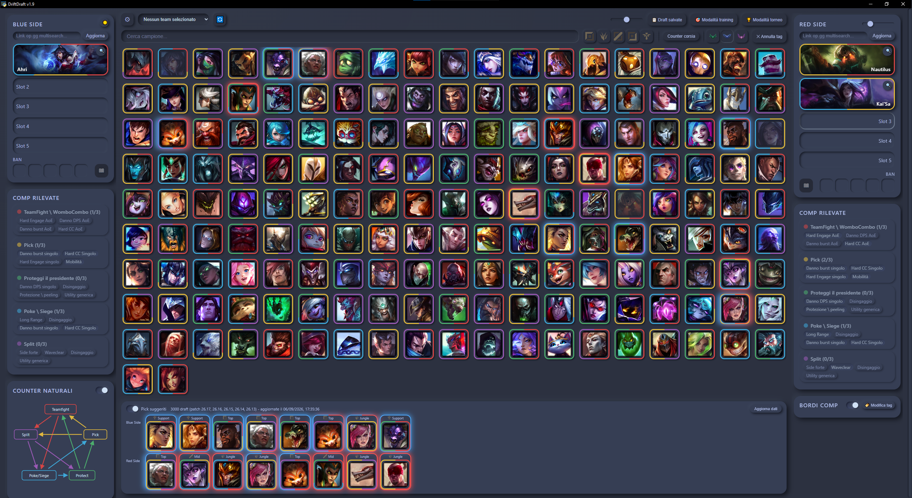
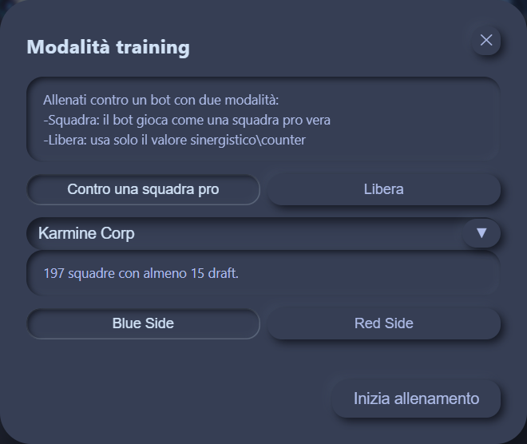
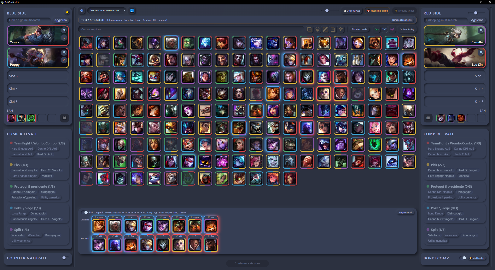
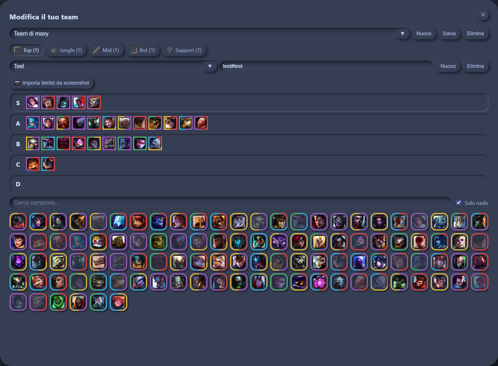

# DriftDraft

Strumento di coaching per le draft di *League of Legends*. Ti dice che
composizioni stanno prendendo forma mentre draftate, quali pick convengono a
ciascun lato, sia come preparazione che in tempo reale su drafter.lol, e ti allena contro un bot che gioca come una squadra vera.

Gira sul tuo computer completamente in locale: **nessun dato esce dal tuo pc**, tranne le
richieste che fai tu a op.gg, lolalytics, u.gg, Leaguepedia e drafter.lol.

## Cosa può fare DriftDraft per te

**Vede le composizioni mentre le costruite.** Ogni campione porta tag
funzionali e appartenenze; i pannelli laterali dicono a colpo
d'occhio cosa sta nascendo da una parte e dall'altra, e quali pezzi mancano
ancora. Il pentagono dei counter naturali mostra quale comp batte quale.

**Suggerisce i pick, per lato.** Il punteggio nasce da sinergie e counter
osservati in 3000 draft professionistiche recenti.

**Allenamento contro pick veri.** Il bot impersona una
squadra pro vera, scelta da te o a sorte fra 197, pescando fra quello che
quella squadra gioca. Ragiona per composizioni:
capisce cosa stai provando a fare e prova ad anticiparti.

**Capire la tua squadra.** Nel roster tieni i tuoi giocatori con la loro tier
list personale — S per gli OTP, giù fino a D per quelli da evitare — e i
suggerimenti per il tuo lato escono da lì, in alternativa basta un op.gg del tuo team nel giusto side.
Inoltre, con un link op.gg si possono ottenere i dati avversari in automatico, con pick consigliati aggiornati di conseguenza.

**Si collega a una draft vera.** In modalità torneo specchia in tempo reale
una draft room di [drafter.lol](https://drafter.lol) e manda le tue selezioni
come azioni sulla draft, con supporto alla fearless draft.

# Qualche esempio:

## Installazione

Scarica l'installer dall'ultima
[release](https://github.com/T57HeavyTank/DriftDraft/releases) e avvialo:
dentro c'è tutto, funziona da subito.

Al primo avvio scarica le immagini dei campioni (~21 MB, un minuto scarso):
serve una connessione, e si fa una volta sola.

Per lavorare sul codice invece che usarlo, vedi
[CONTRIBUTING.md](CONTRIBUTING.md).

## Licenza

DriftDraft e' software libero sotto **GNU General Public License v3.0 o
successiva** — vedi [LICENSE](LICENSE).

Puoi usarlo, studiarlo, modificarlo e ridistribuirlo. Se lo ridistribuisci,
modificato o no, devi farlo sotto la stessa licenza e rendere disponibile il
sorgente: nessuno puo' prenderlo, chiuderlo e spacciarlo per proprio.

Il programma e' distribuito nella speranza che sia utile, ma **SENZA ALCUNA
GARANZIA**, senza neppure la garanzia implicita di COMMERCIABILITA' o
IDONEITA' PER UNO SCOPO PARTICOLARE. Vedi la GNU General Public License per i
dettagli.

## Riconoscimenti e provenienza dei dati

Cosa e' di altri e da dove viene — librerie, uBlock Origin Lite spedito col
pacchetto, immagini dei campioni, dati delle draft pro — sta in
[THIRD-PARTY.md](THIRD-PARTY.md), insieme alla nota legale di Riot Games.

I tag dei campioni e le cinque composizioni sono invece lavoro originale
dell'autore, compilato a mano.

DriftDraft was created under Riot Games' "Legal Jibber Jabber" policy using
assets owned by Riot Games. Riot Games does not endorse or sponsor this
project.
